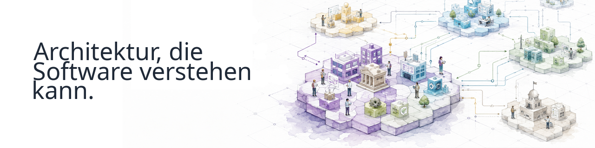

  

      

## Continuous-Driven Architecture

Wir sind eine Open-Source-Organisation, die Werkzeuge und Grundlagen entwickelt, um Architektur für Software verständlich und nutzbar zu machen.

Wir verstehen Architektur als strukturiertes, semantisches Wissen, das Software über komplexe Ökosysteme hinweg validieren, transformieren, verknüpfen und kontinuierlich nutzen kann.

## Einstieg

### [archi-semantic-core](https://github.com/Continuous-DrivenArchitecture/archi-semantic-core/blob/main/README.de.md)

Entdecken Sie auf Deutsch die semantische Grundlage hinter CDA.