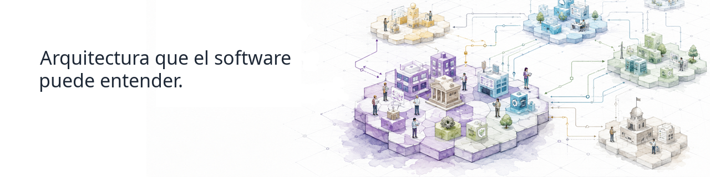

  

      

## Continuous-Driven Architecture

**Continuous-Driven Architecture (CDA)** es una organización de código abierto que construye herramientas y cimientos para que la arquitectura sea **comprensible y utilizable por el software**.

Tratamos la arquitectura como conocimiento estructurado y semántico que puede **validarse, transformarse, conectarse y utilizarse de forma continua en ecosistemas complejos**.

## Lo que estamos construyendo

### [archi-semantic-core](https://github.com/Continuous-DrivenArchitecture/archi-semantic-core)

Una base semántica para trabajar programáticamente con modelos de arquitectura.

Llegan más proyectos a medida que evoluciona el ecosistema de CDA.

## Participa

Explora nuestros proyectos, abre un issue, propone una idea o aporta código.

**[Explora Continuous-Driven Architecture →](https://github.com/Continuous-DrivenArchitecture)**