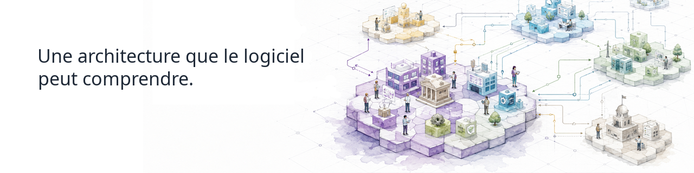

  

      

## Continuous-Driven Architecture

**Continuous-Driven Architecture (CDA)** est une organisation open source qui construit des outils et des fondations pour rendre l'architecture **compréhensible et utilisable par les logiciels**.

Nous traitons l'architecture comme une connaissance structurée et sémantique qui peut être **validée, transformée, connectée et utilisée en continu à travers des écosystèmes complexes**.

## Ce que nous construisons

### [archi-semantic-core](https://github.com/Continuous-DrivenArchitecture/archi-semantic-core/blob/main/README.fr.md)

Une fondation sémantique pour travailler programmatiquement avec des modèles d'architecture.

D'autres projets arrivent au fil de l'évolution de l'écosystème CDA.

## Participez

Explorez nos projets, ouvrez une issue, proposez une idée ou contribuez du code.

**[Explorez Continuous-Driven Architecture →](https://github.com/Continuous-DrivenArchitecture)**