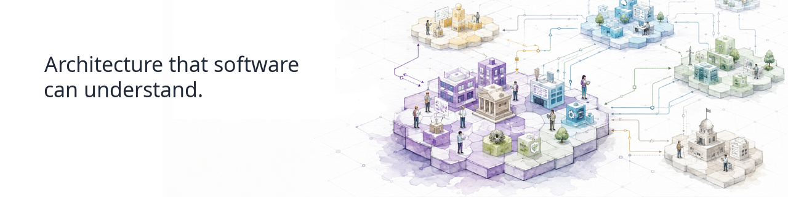

  

      

## Continuous-Driven Architecture

**Continuous-Driven Architecture (CDA)** is an open-source organization building tools and foundations to make architecture **understandable and usable by software**.

We treat architecture as structured, semantic knowledge that can be **validated, transformed, connected, and continuously used across complex ecosystems**.

## What we're building

### [archi-semantic-core](https://github.com/Continuous-DrivenArchitecture/archi-semantic-core)

A semantic foundation for working programmatically with architecture models.

More projects are coming as the CDA ecosystem evolves.

## Get involved

Explore our projects, open an issue, propose an idea, or contribute code.

**[Explore Continuous-Driven Architecture →](https://github.com/Continuous-DrivenArchitecture)**
