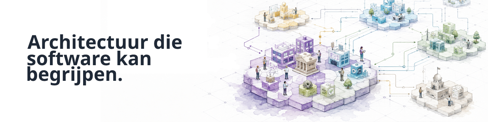

  

      

## Continuous-Driven Architecture

**Continuous-Driven Architecture (CDA)** is een open-sourceorganisatie die tools en fundamenten bouwt om architectuur **begrijpelijk en bruikbaar voor software** te maken.

Wij behandelen architectuur als gestructureerde, semantische kennis die binnen complexe ecosystemen **gevalideerd, getransformeerd, verbonden en continu gebruikt** kan worden.

## Waar we aan bouwen

### [archi-semantic-core](https://github.com/Continuous-DrivenArchitecture/archi-semantic-core/blob/main/README.nl.md)

Een semantisch fundament voor het programmatisch werken met architectuurmodellen.

Er komen meer projecten aan naarmate het CDA-ecosysteem evolueert.

## Doe mee

Verken onze projecten, open een issue, stel een idee voor of draag code bij.

**[Verken Continuous-Driven Architecture →](https://github.com/Continuous-DrivenArchitecture)**