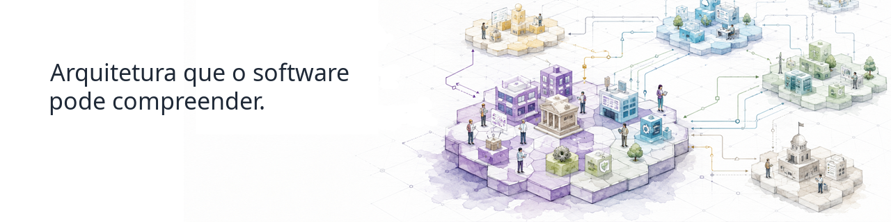

  

      

## Continuous-Driven Architecture

Somos uma organização de código aberto que constrói ferramentas e fundamentos para tornar a arquitetura compreensível e utilizável pelo software.

Abordamos a arquitetura como conhecimento estruturado e semântico que o software pode validar, transformar, ligar e utilizar de forma contínua em ecossistemas complexos.

## Comece aqui

### [archi-semantic-core](https://github.com/Continuous-DrivenArchitecture/archi-semantic-core/blob/main/README.pt.md)

Explore em português a base semântica por trás da CDA.