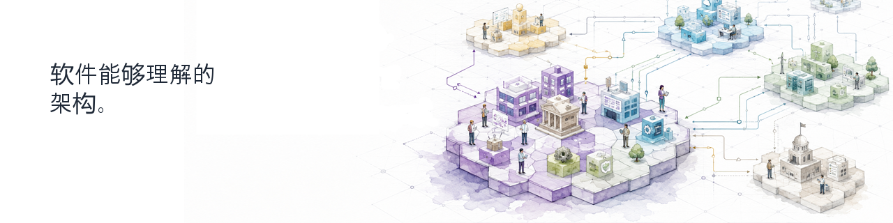

  

      

## Continuous-Driven Architecture

**Continuous-Driven Architecture (CDA)** 是一个开源组织，致力于构建工具与基础能力，让架构对软件而言**可理解、可使用**。

我们将架构视为结构化的语义知识，可以在复杂生态系统中被**验证、转换、连接并持续使用**。

## 我们在构建什么

### [archi-semantic-core](https://github.com/Continuous-DrivenArchitecture/archi-semantic-core/blob/main/README.zh.md)

以编程方式处理架构模型的语义基础。